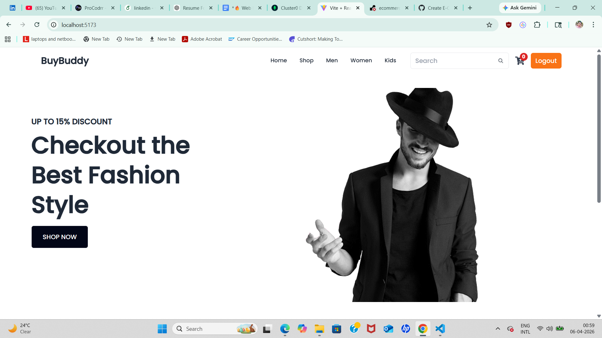
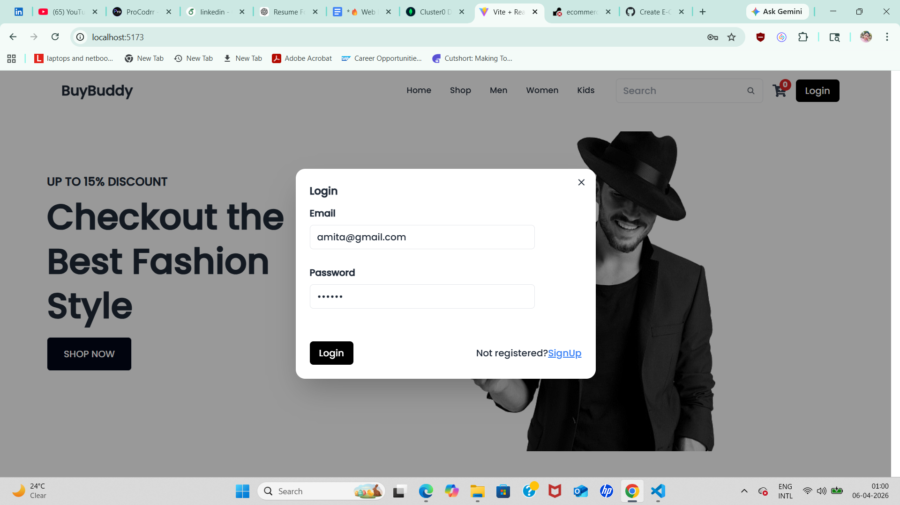
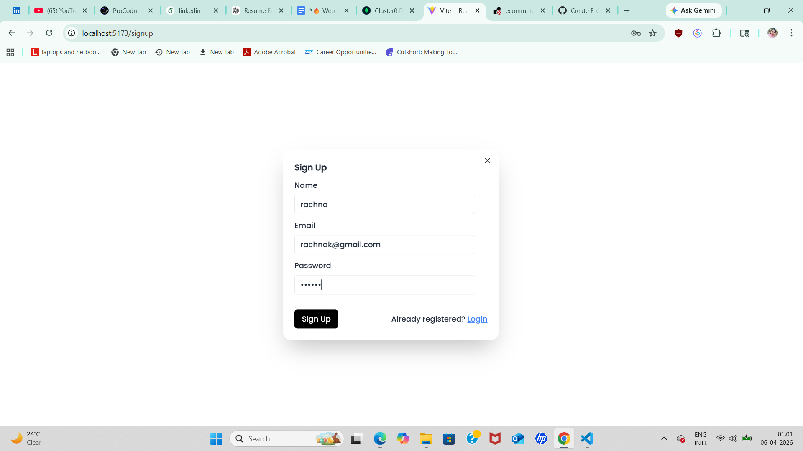
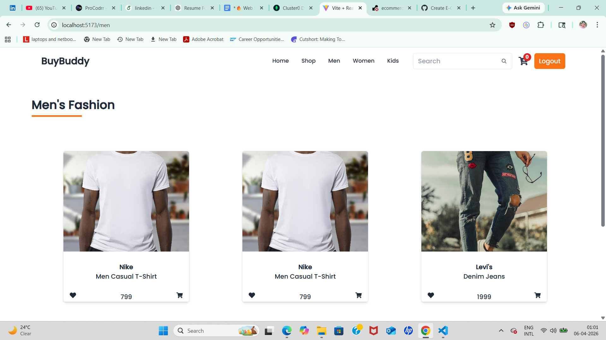
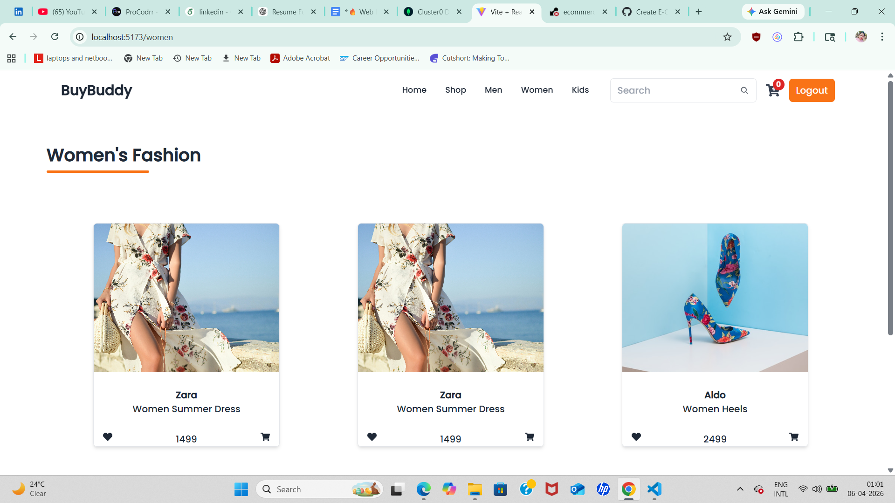
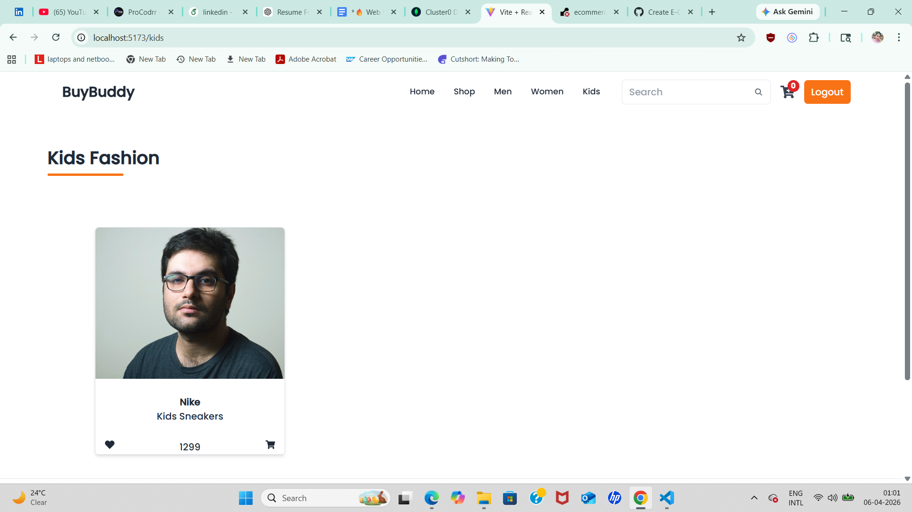

# 🛒 E-Commerce Web Application (MERN Stack)

A full-stack E-Commerce web application with authentication, product management, search functionality, and cart features. Built using the MERN stack (MongoDB, Express.js, React.js, Node.js).

---

## 🚀 Features

### 🔐 Authentication
- User Signup & Login
- JWT-based Authentication
- Secure Password Handling (bcrypt)
- Logout functionality

### 🛍️ Product Management
- Create, Read, Update, Delete (CRUD) operations
- Categorized products (Men, Women, Kids, Accessories)
- Backend API for product handling

### 🔍 Search & Filter
- Search products by keyword
- Filter products by category and gender
- Backend-powered filtering for better performance

### 🛒 Cart System
- Add to Cart functionality
- Manage cart items
- Dynamic UI updates

### 🎨 Frontend UI
- Responsive design
- Clean and modern UI
- Product listing with images
- Category-based pages

---

## 🛠️ Tech Stack

### Frontend
- React.js
- Axios
- Tailwind CSS

### Backend
- Node.js
- Express.js

### Database
- MongoDB (Atlas)

### Authentication
- JWT (JSON Web Token)
- bcrypt

---

## 📁 Project Structure

```bash
project/
├── backend/
│   ├── controllers/
│   ├── models/
│   ├── routes/
│   └── server.js
│
├── frontend/
│   ├── components/
│   ├── pages/
│   └── App.js

---

## ⚙️ Installation & Setup

### 1️⃣ Clone the Repository
```bash
git clone https://github.com/your-username/ecommerce-app.git

2️⃣ Backend Setup
cd backend
npm install

Create .env file:

PORT=8000
DATABASE_URL=your_mongodb_url
JWT_SECRET=your_secret_key

Run backend:

npm start
3️⃣ Frontend Setup
cd frontend
npm install
npm run dev
🔗 API Endpoints
👤 User Routes
POST /api/signup → Register user
POST /api/login → Login user
📦 Product Routes
GET /item/v1/getItem → Get all items
POST /item/v1/createItem → Add item
PUT /item/v1/updateItem/:id → Update item
DELETE /item/v1/deleteItem/:id → Delete item
🔍 Search
GET /search?query=keyword → Search products
---
📌 Future Improvements
Payment Integration
Order Management System
Admin Dashboard
Wishlist Feature
---
## 📸 Screenshots

### Home Page


### Login


### Signup


### Men's Collection


### Women's Collection


### Kids Collection

